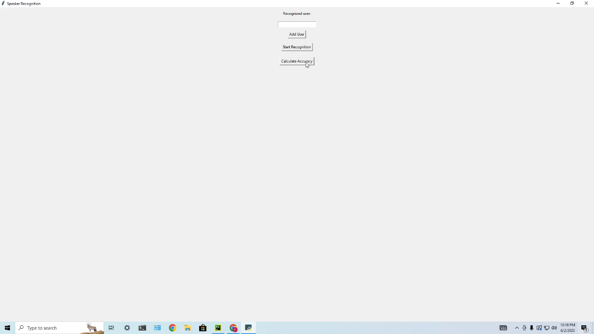

 

  

  <h3 align="center">Voice Recognition And User Detection</h3>

  

    A program written in python that can detect users using their voice.
     
     
    <a href="https://github.com/ShamimReza-create/voice-recognition-and-user-detection"><strong>Explore the docs »</strong></a>
     
     
    <a href="https://github.com/ShamimReza-create/voice-recognition-and-user-detection/issues">Report Bug</a>
    .
  

      

## Table Of Contents

* [About the Project](#about-the-project)
* [Built With](#built-with)
* [Getting Started](#getting-started)
  * [Prerequisites](#prerequisites)
  * [Installation](#installation)
* [Usage](#usage)
* [Roadmap](#roadmap)
* [Contributing](#contributing)
* [License](#license)
* [Authors](#authors)
* [Acknowledgements](#acknowledgements)

## About The Project

This project was created as an assignment for My Digital Signal Processing Course. 
The code is written in python and uses concepts from machine learning to provide the desired output.
What the program does is:

1. Takes audio input from user to build a dataset.
2. Preprocesses the audio data.
3. Saves it for future use.
4. Can recognize users based on saved data.

Please note that, this is just a mere concept of the program. The original inner workings of this program requires a decent amount of knowledge on Machine Learning and Digital Signal Processing.

## Built With

Python

## Getting Started

To get started, one may follow the below description.

### Prerequisites

1. Must have Python installed and added to path on the system.
2. Libraries used:
* matplotlib
* scipy
* sounddevice
* tkinter
* numpy

### Installation

If you use PyCharm to code, then follow this:
1. Create a new project 
2. Open the newly created project directory.
3. Create a folder with a sub-folder "...../Datasets/1" inside the project directory.
4. Make sure all the necessary libraries are installed. If not, you can install them with command: pip install ........
5. Create a new Python file inside the project folder.
6. Copy the code from my github repository and paste it inside the python file.
7. Run the code and Enjoy.

For others, just follow the equivalent steps.

## Usage

Just run the program from IDE, add a new user and provide with their name and voice sample. Then start recognition and enjoy.

## Roadmap

I do not wish to further development this project. But there is no harm in writing about some stuff, that I wish I had added in the code:
1. An even more interactive GUI.
2. The program being able to talk back or chat with the user.(API integration)
3. Creating an executable file.

These three ideas came into my mind while I was working on the project.

## Contributing

Contributions are what make the open source community such an amazing place to be learn, inspire, and create. Any contributions you make are **greatly appreciated**.
* If you have suggestions for adding or removing projects, feel free to [open an issue](https://github.com/ShamimReza-create/voice-recognition-and-user-detection/issues/new) to discuss it, or directly create a pull request after you edit the *README.md* file with necessary changes.
* Please make sure you check your spelling and grammar.
* Create individual PR for each suggestion.
* Please also read through the [Code Of Conduct](https://github.com/ShamimReza-create/voice-recognition-and-user-detection/blob/main/CODE_OF_CONDUCT.md) before posting your first idea as well.

### Creating A Pull Request

Just Download and enjoy

## License

Distributed under the MIT License. See [LICENSE](https://github.com/ShamimReza-create/voice-recognition-and-user-detection/blob/main/LICENSE.md) for more information.

## Authors

* **Shamim Reza** - *Electrical Eng. student* - [Shamim Reza](https://github.com/ShamimReza-create) - **

